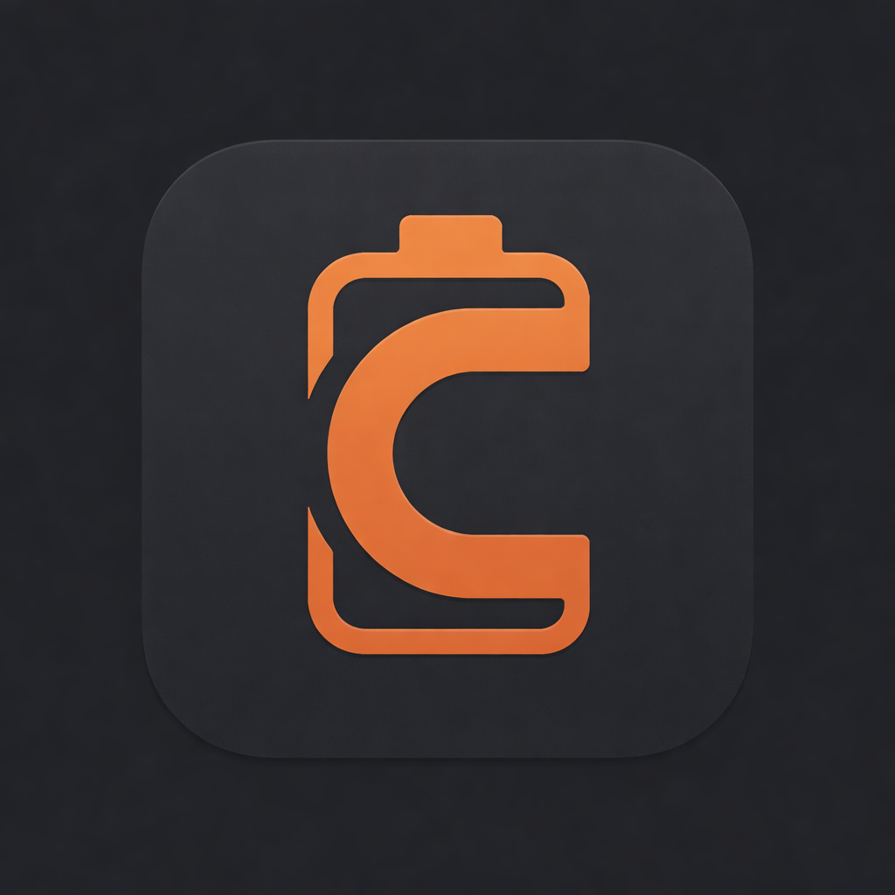
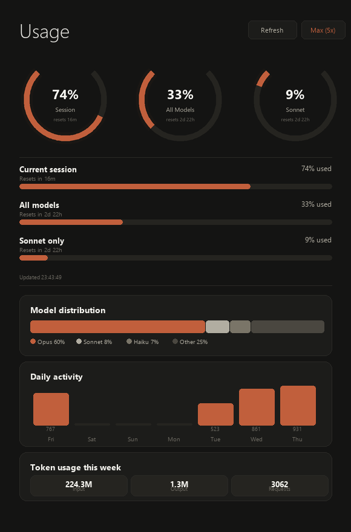

<p align="center">
  
</p>

<h1 align="center">Claude Pulse</h1>

<p align="center">
  Track your Claude Code usage with live gauges, model stats, and rate-limit alerts.
  <br>
  System tray app for Windows — built with Python, CustomTkinter, and PIL.
</p>

<p align="center">
  
</p>

## Features

- **System tray icon** with battery-style indicator showing current session usage
- **Live dashboard** with smooth, anti-aliased arc gauges (PIL-rendered at 2x)
- **Three usage windows** — Session (5h), Weekly All Models, Weekly Sonnet
- **Progress bars** with reset countdown timers
- **Model distribution** breakdown (Opus / Sonnet / Haiku / Other)
- **Daily activity** chart from local JSONL logs
- **Token stats** — input, output, and total requests for the week
- **Smart rate-limit handling** — exponential backoff, disk-persisted cache, graceful degradation
- **OAuth token refresh** — automatically refreshes expired tokens
- **Auto-refresh** every 60 seconds (configurable)

## How It Works

The app reads your Claude Code OAuth credentials from `~/.claude/.credentials.json` and calls the Anthropic usage API. Local breakdown data (model distribution, daily activity, token counts) is parsed from the JSONL conversation logs in `~/.claude/projects/`.

When the API is rate-limited, the app falls back to cached data with a staleness indicator — no crashes, no blank screens.

## Quick Start

> **Just want the app?** Download the latest `ClaudeUsageMonitor.exe` from the [Releases page](https://github.com/yigitbozyaka/claude-pulse/releases/latest) — no Python or dependencies needed. Run it and you're done.

### Prerequisites

- Windows 10/11
- [Claude Code](https://docs.anthropic.com/en/docs/claude-code) installed and logged in (OAuth credentials must exist at `~/.claude/.credentials.json`)

### From Source

```bash
git clone https://github.com/yigitbozyaka/claude-pulse.git
cd claude-pulse
pip install -r requirements.txt
python claude_usage.py
```

### Build Your Own Binary

```bash
pip install pyinstaller
pyinstaller ClaudeUsageMonitor.spec
# Output: dist/ClaudeUsageMonitor.exe
```

## Configuration

Edit `config.json` to customize:

```json
{
  "refresh_interval_seconds": 60
}
```

## Usage

1. Run the app — it appears as a battery icon in the system tray
2. **Double-click** the tray icon to open the dashboard
3. **Right-click** for quick actions: Open Dashboard, Refresh, Quit

The tray icon shows your current session usage percentage and updates automatically.

## Design

Monochrome terracotta palette inspired by Claude's brand:

| Element   | Color     |
|-----------|-----------|
| Background | `#141413` |
| Surface    | `#1c1c1a` |
| Accent     | `#c15f3c` |
| Text       | `#f4f3ee` |

All charts and gauges are rendered with PIL at 2x resolution and downsampled with Lanczos filtering for smooth, anti-aliased visuals.

## License

MIT
